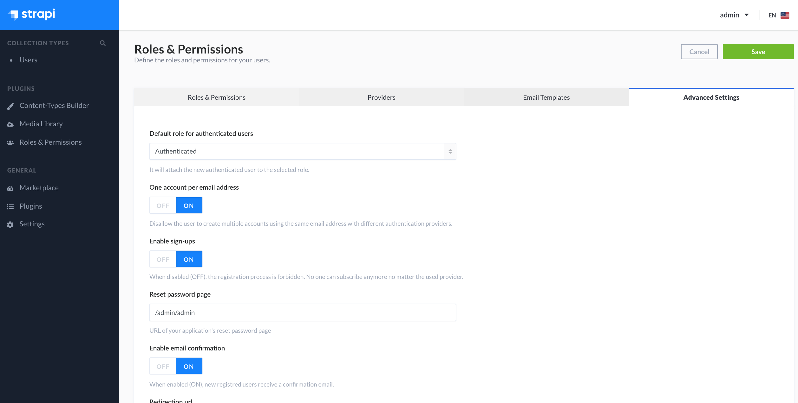
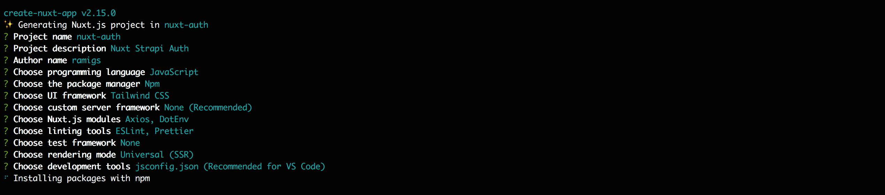
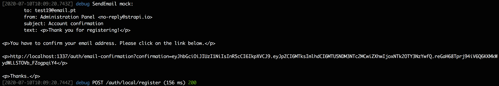
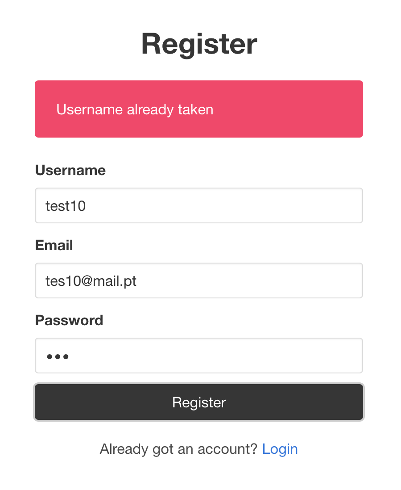
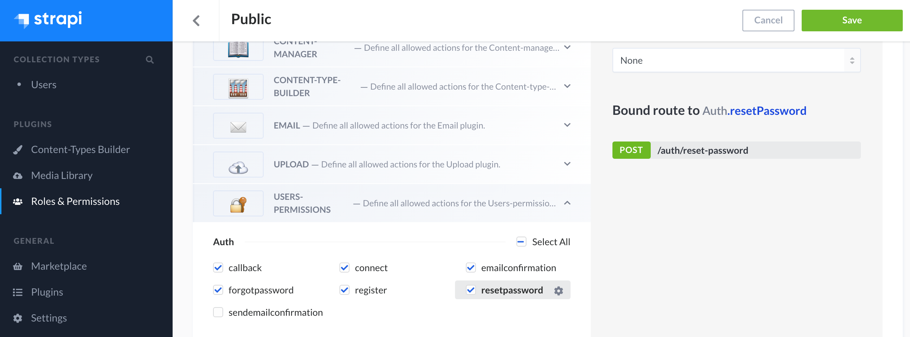

# Strapi Authentication in Nuxt.js

This tutorial is a step-by-step guide on how to implement Strapi Authentication
and in Nuxt.js app.

We are going to build two projects:

- Backend: Strapi app to store and manage users
- Frontend: Nuxt app that will use Strapi's API for authentication purposes

We'll be relying on Nuxt's [Auth Module](https://auth.nuxtjs.org/), which is the
official zero-boilerplate authentication module for Nuxt.js.

JWT token username password

We will also be implementing some basic authorization features, such as
restricting certain pages to only logged in users.

This guide builds on top of Chimezie Enyinnaya's excellent
[work](https://www.digitalocean.com/community/tutorials/implementing-authentication-in-nuxtjs-app),
adapting it to Strapi's specific use case, and also adding the following
features:

- Email confirmation for registration
- Password reset
- Token expiration strategy

I won't go into detailed explanation at every step. Instead, I'll focus on
Strapi and the added features/functionality.

For everything else, I recommend you refer to Chimezie's tutorial already does
it so well.

## Pre-requisites

To follow this tutorial, make sure you have Node.js installed:

- Node.js 12.x
- npm 6.x

Although not required, a basic knowledge of Strapi and Nuxt.js is recommended.

> Disclaimer: this tutorial was written based on Strapi 3.0.1 (stable release)
> and Nuxt.js 2.12.2. It should work on different versions too, but you may need
> to make some adaptations it here and there.

Let's get started!

## Install Strapi

First things first, we begin by creating a Strapi project:

```shell
npx create-strapi-app strapi-users --quickstart
```

We've used the `--quickstart` flag that installs Strapi with default settings.
It also tells Strapi to use SQLite as the database engine and automatically run
our application:

> In our installation, we used the default database, SQLite, because it doesn’t
> require a dedicated database server. Instead, the database is just a single
> file. For practicability, we'll be using it in this tutorial, but the steps in
> this guide also apply to different database engines.

After the installation, Strapi will automatically launch in your browser, asking
you to create an administrator account.

To finish the setup and secure your app, go ahead and create the root admin
user, by entering the necessary information below:

PRINTSCREEN

From now on, you can access Strapi's local Admin interface by visiting
[http://localhost:1337/admin](http://localhost:1337/admin).

## Enable email confirmation

By default, the user registration process in Strapi does not include email
confirmation.

To enable it, from the left sidebar of the Admin dashboard, click **Roles &
Permissions**. Select the **Advanced Settings** tab, enable the "Enable email
confirmation" option and save:



## Email console provider

Thanks to Strapi's Email plugin, we can have a Strapi instance send emails from
our server's local email system or externals providers (e.g., SendGrid).

Email setup and configuration is not within the scope of this article. We just
want to make sure that the emails are being fired when expected and inspect
their content.

For that, we're going to use
[strapi-provider-email-console](https://www.npmjs.com/package/strapi-provider-email-console)
for development, that simply outputs the emails to the console.

So, let's install the email provider module. Stop the Strapi app that's running
and install the new email provider:

```shell
cd strapi-users
npm install strapi-provider-email-console
```

Once the installation is done, you'll need to add the provider in
`./config/plugins.js`:

```javascript
module.exports = ({ env }) => ({
  email: {
    provider: "console",
  },
});
```

Since we've used `--quickstart` the first time we ran our Strapi app, before
running it in development mode we need to install its dependencies:

```shell
npm install
```

Once that's done, start the Strapi app in development mode with the command:

```shell
npm run develop
```

## Create a Nuxt app

Now, let's change gears and focus on the frontend app. It will be a Universal
SSR Nuxt.js app.

To get started quickly, we'll create the project using Nuxt's scaffolding tool:

```shell
npx create-nuxt-app nuxt-auth
```

Go through the guide and make sure the following options are selected:

- axios and dotenv in the **Nuxt.js modules** step
- Bulma CSS in the **UI framework** step, which we'll use to style our app



Strapi's API URL will vary depending on the environment. So, we want to have it
loaded dynamically from an environment variable.

Once the tool finishes creating the app, we're going to edit the `.env` file in
the project's root directory, and add a new environment variable that points to
the URL of the Strapi app that's running:

```
API_AUTH_URL=http://localhost:1337
```

Next, navigate to the project's root directory and install the required Nuxt
Auth module dependency:

```shell
cd nuxt-auth
npm install @nuxtjs/auth
```

Once the installation is done, add the module in `nuxt.config.js`:

```javascript
modules: [
  // Doc: https://github.com/nuxt-community/modules/tree/master/packages/bulma
  '@nuxtjs/bulma',
  // Doc: https://axios.nuxtjs.org/usage
  '@nuxtjs/axios',
  // Doc: https://github.com/nuxt-community/dotenv-module
  '@nuxtjs/dotenv',
  '@nuxtjs/auth'
],
```

At the top of `nuxt.config.js`, add also the following code to load the
environment variables:

```javascript
require("dotenv").config();
```

One last step we need to do in this file. Configure the base URL that axios will
use when making API requests (which is the environment variable we've added
previously):

```javascript
axios: {
  baseURL: process.env.API_AUTH_URL
},
```

## Configure Nuxt Auth

The Auth module uses Vuex's state management to store the user authentication
status and user info.

Enable the Vuex store by creating a `./store/index.js` file with the store
getters:

```javascript
export const getters = {
  isAuthenticated(state) {
    return state.auth.loggedIn;
  },

  loggedInUser(state) {
    return state.auth.user;
  },
};
```

Now, we are ready to configure the Auth module. This is done by specifying the
authentication endpoints for the local strategy with Strapi's authentication
endpoints. The local strategy is based on username and password authentication.

Paste the code below into `nuxt.config.js`:

```javascript
/*
 ** Auth module configuration
 ** See https://auth.nuxtjs.org/schemes/local.html#options
 */
auth: {
  strategies: {
    local: {
      endpoints: {
        login: {
          url: 'auth/local',
          method: 'post',
          propertyName: 'jwt'
        },
        user: {
          url: 'users/me',
          method: 'get',
          propertyName: false
        },
        logout: false
      }
    }
  }
},
```

We've configured two endpoints:

- `login`: authenticates the user. On successful authentication, the JWT token
  will be available in the `jwt` property of the response object.
- `user`: retrieves the authenticated user's info. If the user is authenticated,
  the JWT token will be sent in the request, allowing Strapi to identify the
  user. Since the response object is already the user info, we set
  `propertyName` to `false`.

We've also disabled the `logout` endpoint, since logging out a user is only done
locally, and doesn't require any request to Strapi's API. The token is simply
removed the from the local storage when the user logs out.

## Navbar Component

Create a file `./components/Navbar.vue` with the following code:

```vue
<template>
  <nav class="navbar" role="navigation" aria-label="main navigation">
    <div class="navbar-brand">
      <nuxt-link class="navbar-item" to="/">Home</nuxt-link>

      <a
        role="button"
        class="navbar-burger burger"
        aria-label="menu"
        aria-expanded="false"
        data-target="navbarBasicExample"
      >
        <span aria-hidden="true"></span>
        <span aria-hidden="true"></span>
        <span aria-hidden="true"></span>
      </a>
    </div>

    <div id="navbarBasicExample" class="navbar-menu">
      <div v-if="isAuthenticated" class="navbar-start">
        <div class="navbar-item has-dropdown is-hoverable">
          <a class="navbar-link">
            {{ loggedInUser.username }}
          </a>

          <div class="navbar-dropdown">
            <a class="navbar-item" href="/profile">My Profile</a>
            <hr class="navbar-divider" />
            <a class="navbar-item" @click="logout">Logout</a>
          </div>
        </div>
      </div>

      <div v-if="!isAuthenticated" class="navbar-end">
        <div class="navbar-item">
          <div class="buttons">
            <nuxt-link class="button is-primary" to="/register">
              <strong>Register</strong>
            </nuxt-link>
            <nuxt-link class="button is-light" to="/login">
              Log in
            </nuxt-link>
          </div>
        </div>
      </div>
    </div>
  </nav>
</template>
```

Let us make component functional by adding the following `<script></script>`
code:

```vue
<script>
import { mapGetters } from "vuex";

export default {
  computed: {
    ...mapGetters(["isAuthenticated", "loggedInUser"]),
  },
  mounted() {
    // Get all "navbar-burger" elements
    const $navbarBurgers = Array.prototype.slice.call(
      document.querySelectorAll(".navbar-burger"),
      0
    );
    // Check if there are any navbar burgers
    if ($navbarBurgers.length > 0) {
      // Add a click event on each of them
      $navbarBurgers.forEach((el) => {
        el.addEventListener("click", () => {
          // Get the target from the "data-target" attribute
          const target = el.dataset.target;
          const $target = document.getElementById(target);
          // Toggle the "is-active" class on both the "navbar-burger" and the "navbar-menu"
          el.classList.toggle("is-active");
          $target.classList.toggle("is-active");
        });
      });
    }
  },
};
</script>
```

We've defined the computed properties `isAuthenticated` and `loggedInUser` used
in the component's template. These come from the previously created store
getters.

The code in the `mounted` hook comes from [Bulma's Navbar
documentation](https://bulma.io/documentation/components/navbar/). Its purpose
is to toggle the display of the `navbar-menu` when the `navbar-burger` icon is
clicked.

## Default Layout

Edit `./layouts/default.vue` and replace its content with the following:

```vue
<template>
  <div>
    <Navbar />
    <nuxt />
  </div>
</template>

<script>
import Navbar from "~/components/Navbar";

export default {
  components: {
    Navbar,
  },
};
</script>
```

## Homepage

Edit `./pages/index.vue` and replace its content with the following:

```vue
<template>
  <section class="section">
    <div class="container">
      <h1 class="title">Nuxt Auth</h1>
    </div>
  </section>
</template>
```

This is what we have so far:

PRINTSCREEN

## Notification Component

Let’s create a Notification component to give feedback to the user.

If everything goes as expected it should display a success message. Otherwise,
an error message should be displayed.

Create a file `./components/Notification.vue` and paste into it the code below:

```vue
<template>
  <div :class="`is-${type}`" class="notification">
    {{ message }}
  </div>
</template>

<script>
export default {
  name: "Notification",
  props: {
    type: {
      type: String,
      default: "success",
      validator: (val) => ["danger", "success"].includes(val),
    },
    message: {
      type: String,
      default: "",
    },
  },
};
</script>
```

## Register

Create a file `./pages/register.vue` and paste into it the code below:

```vue
<template>
  <section class="section">
    <div class="container">
      <div class="columns">
        <div class="column is-4 is-offset-4">
          <h2 class="title has-text-centered">Register User</h2>

          <Notification v-if="success" type="success" :message="success" />
          <Notification v-if="error" type="danger" :message="error" />

          <form v-if="!success" method="post" @submit.prevent="register">
            <div class="field">
              <label class="label">Username</label>
              <div class="control">
                <input
                  v-model="username"
                  type="text"
                  class="input"
                  name="username"
                  required
                />
              </div>
            </div>
            <div class="field">
              <label class="label">Email</label>
              <div class="control">
                <input
                  v-model="email"
                  type="email"
                  class="input"
                  name="email"
                  required
                />
              </div>
            </div>
            <div class="field">
              <label class="label">Password</label>
              <div class="control">
                <input
                  v-model="password"
                  type="password"
                  class="input"
                  name="password"
                  required
                />
              </div>
            </div>
            <div class="control">
              <button type="submit" class="button is-dark is-fullwidth">
                Register
              </button>
            </div>
          </form>

          <div class="has-text-centered" style="margin-top: 20px">
            Already got an account? <nuxt-link to="/login">Login</nuxt-link>
          </div>
        </div>
      </div>
    </div>
  </section>
</template>

<script>
import Notification from "~/components/Notification";

export default {
  components: {
    Notification,
  },

  data() {
    return {
      username: "",
      email: "",
      password: "",
      success: null,
      error: null,
    };
  },

  methods: {
    async register() {
      try {
        this.$axios.setToken(false);
        await this.$axios.post("auth/local/register", {
          username: this.username,
          email: this.email,
          password: this.password,
        });
        this.success = `A confirmation link has been sent to your email account. \
        Please click on the link to confirm your email to complete the registration process.`;
      } catch (e) {
        this.error = e.response.data.message[0].messages[0].message;
      }
    },
  },
};
</script>
```

Before hitting Strapi's register endpoint, we make sure no token will be added
as a request header.

### Test Register

We're now ready to test the register feature.

Open a new terminal and run the Nuxt app in development mode:

```shell
npm run dev
```

Navigate to [http://localhost:3000/register](http://localhost:3000/register) and
register a user.

If the registration was successful, a success message is displayed by the
Notification component, requesting that the user completes the registration
process by clicking the confirmation link in sent email:


Switch to the console where Strapi is running and confirm that you see the
confirmation email:



Copy the link and access it in your browser. This action completes the
registration of the user.

add http://localhost:1337/

"The a link which will redirect the user back to our app."
redirects to http://localhost:1337/admin/auth/login

If an error occurs, the error message is displayed by the Notification component
we've created previously:



## Login

Create a file `./pages/login.vue` and paste into it the code below:

```vue
<template>
  <section class="section">
    <div class="container">
      <div class="columns">
        <div class="column is-4 is-offset-4">
          <h2 class="title has-text-centered">Log In</h2>

          <Notification v-if="error" type="danger" :message="error" />

          <form method="post" @submit.prevent="login">
            <div class="field">
              <label class="label">Email</label>
              <div class="control">
                <input
                  v-model="email"
                  type="email"
                  class="input"
                  name="email"
                />
              </div>
            </div>
            <div class="field">
              <label class="label">Password</label>
              <div class="control">
                <input
                  v-model="password"
                  type="password"
                  class="input"
                  name="password"
                />
              </div>
            </div>
            <div class="control">
              <button type="submit" class="button is-dark is-fullwidth">
                Log In
              </button>
            </div>
          </form>
          <div class="has-text-centered" style="margin-top: 20px">
            <p>
              Don't have an account?
              <nuxt-link to="/register">Register</nuxt-link>
            </p>
          </div>
        </div>
      </div>
    </div>
  </section>
</template>

<script>
import Notification from "~/components/Notification";

export default {
  components: {
    Notification,
  },

  data() {
    return {
      email: "",
      password: "",
      error: null,
    };
  },

  methods: {
    async login() {
      try {
        await this.$auth.loginWith("local", {
          data: {
            identifier: this.email,
            password: this.password,
          },
        });
        this.$router.push("/");
      } catch (e) {
        this.error = e.response.data.message[0].messages[0].message;
      }
    },
  },
};
</script>
```

## Logout

Let's now add the `logout` method that's triggered when the user clicks the
**Logout** Navbar link.

Edit `./components/Navbar.vue` and add the following code under `mounted()`:

```javascript
methods: {
    async logout() {
      await this.$auth.logout()
    }
  }
```

## User Profile

Time for the user profile page.

Create a file `./pages/profile.vue` with the following code:

```vue
<template>
  <section class="section">
    <div class="container">
      <h2 class="title">My Profile</h2>
      <div class="content">
        <p>
          <strong>Username:</strong>
          {{ loggedInUser.username }}
        </p>
        <p>
          <strong>Email:</strong>
          {{ loggedInUser.email }}
        </p>
      </div>
    </div>
  </section>
</template>

<script>
import { mapGetters } from "vuex";

export default {
  middleware: "auth",
  computed: {
    ...mapGetters(["loggedInUser"]),
  },
};
</script>
```

The `auth` middleware guarantees that only logged in users can access this page.

## Guest middleware

If the user is logged in, it probably makes sense to block the access to the
register and login pages.

Create a file `./middleware/guest.js`:

```javascript
export default function ({ store, redirect }) {
  if (store.state.auth.loggedIn) {
    return redirect("/");
  }
}
```

Define the new middleware in `./pages/register.vue` and `./pages/login.vue`:

```javascript
export default {
  middleware: "guest",
};
```

## Password Reset

Let's now implement a password reset mechanism.

Create a file `./pages/forgot-password.vue`:

```vue
<template>
  <section class="section">
    <div class="container">
      <div class="columns">
        <div class="column is-4 is-offset-4">
          <h2 class="title has-text-centered">Forgot Password</h2>

          <Notification v-if="success" type="success" :message="success" />
          <Notification v-if="error" type="danger" :message="error" />

          <form v-if="!success" method="post" @submit.prevent="forgotPassword">
            <div class="field">
              <label class="label">Email</label>
              <div class="control">
                <input
                  v-model="email"
                  type="email"
                  class="input"
                  name="email"
                />
              </div>
            </div>
            <div class="control">
              <button type="submit" class="button is-dark">
                Email me a reset link
              </button>
            </div>
          </form>
        </div>
      </div>
    </div>
  </section>
</template>

<script>
import Notification from "~/components/Notification";

export default {
  middleware: "guest",
  components: {
    Notification,
  },
  data() {
    return {
      email: "",
      success: null,
      error: null,
    };
  },
  methods: {
    async forgotPassword() {
      try {
        await this.$axios.post("auth/forgot-password", {
          email: this.email,
        });
        this.error = null;
        this.success = `A reset password link has been sent to your email account. \
        Please click on the link to complete the password reset.`;
      } catch (e) {
        this.error = e.response.data.message[0].messages[0].message;
      }
    },
  },
};
</script>
```

> By not promising the user that an email will be sent and not disclosing
> whether the email/username even exists in the database, we 1) encourage them
> to double check their credentials (in case they don’t get the link) and 2)
> prevent phishing attacks.


The method `forgotPassword` sends a POST request to Strapi's
`auth/forgot-password` endpoint. If the email address exists in Strapi's user
database, an email is sent with a link to a reset password page in the frontend
app.

To specify this link, from the left sidebar of the Admin dashboard, click
**Roles & Permissions**. Select the **Advanced Settings** tab, paste
`http://localhost:3000/reset-password` in the "Reset password page" input, and
save:


Strapi will attach to it a URL parameter with the code that's required to
successfully reset the user password.

Let's now create the page that will allow the user to define a new password.
Create a file `./pages/reset-password.vue` and paste the following code into it:

```vue
<template>
  <section class="section">
    <div class="container">
      <div class="columns">
        <div class="column is-4 is-offset-4">
          <h2 class="title has-text-centered">Reset Password</h2>

          <Notification v-if="success" type="success" :message="success" />
          <Notification v-if="error" type="danger" :message="error" />

          <form v-if="!success" method="post" @submit.prevent="resetPassword">
            <div class="field">
              <label class="label">New Password</label>
              <div class="control">
                <input
                  v-model="password1"
                  type="password"
                  class="input"
                  name="password"
                />
              </div>
            </div>
            <div class="field">
              <label class="label">Confirm New Password</label>
              <div class="control">
                <input
                  v-model="password2"
                  type="password"
                  class="input"
                  name="password"
                />
              </div>
            </div>
            <div class="control">
              <button type="submit" class="button is-dark">
                Reset Password
              </button>
            </div>
          </form>
        </div>
      </div>
    </div>
  </section>
</template>

<script>
import Notification from "~/components/Notification";

export default {
  middleware: "guest",
  components: {
    Notification,
  },
  asyncData(context) {
    if (!context.route.query.code) context.redirect("/forgot-password");
    else
      return {
        code: context.route.query.code,
      };
  },
  data() {
    return {
      password1: "",
      password2: "",
      success: null,
      error: null,
    };
  },
  methods: {
    async resetPassword() {
      this.error = null;
      if (this.password1 !== this.password2) {
        this.error = "Passwords do not match.";
        return;
      }
      try {
        await this.$axios.post("auth/reset-password", {
          code: this.code,
          password: this.password1,
          passwordConfirmation: this.password2,
        });
        this.success =
          "Password updated successfully. You can now use it to log in to your account.";
      } catch (e) {
        this.error = e.response.data.message[0].messages[0].message;
      }
    },
  },
};
</script>
```

One more thing before we're able to test the password reset feature. We need to
enable the Public Role permission for the `auth/reset-password` endpoint.

To specify this link, from the left sidebar of the Admin dashboard, click
**Roles & Permissions**. Select the **Advanced Settings** tab, paste
`http://localhost:3000/reset-password` in the "Reset password page" input, and
save:

To do so, from the left sidebar of the Admin dashboard, click **Roles &
Permissions**. Click **Public** and under **Permissions** expand the
**USERS-PERMISSIONS** plugin. Under **Auth** check the option "resetpassword"
and save:



### Test Reset Password

This action will reset the user password.

## Token Expiration

Awesome! We've done a lot, but there's still something missing before we wrap
up.

If the JWT token expires, subsequent requests to Strapi will return a 401
Unauthorized error.

once we get a 401 unauthorized error we need
to redirect the user to the login page.

Create a file `./plugins/axios.js`:

```javascript
export default function ({ $axios, redirect }) {
  $axios.onError((error) => {
    const code = parseInt(error.response && error.response.status);
    if (code === 401) redirect("/login");
  });
}
```

in `nuxt.config.js` import the file we've just created:

```javascript
plugins: ['~plugins/axios'],
```

## Conclusion

Hopefully you've found this tutorial helpful for implementing Strapi
authentication in your Nuxt app :)

The source code for both apps can be found on GitHub:

- [nuxt-auth](https://github.com/ramigs/nuxt-auth)
- [strapi-users](https://github.com/ramigs/strapi-users)

https://youtu.be/0hAmccuaK5Q
https://www.npmjs.com/package/strapi-provider-email-console
